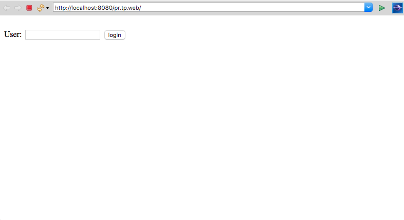
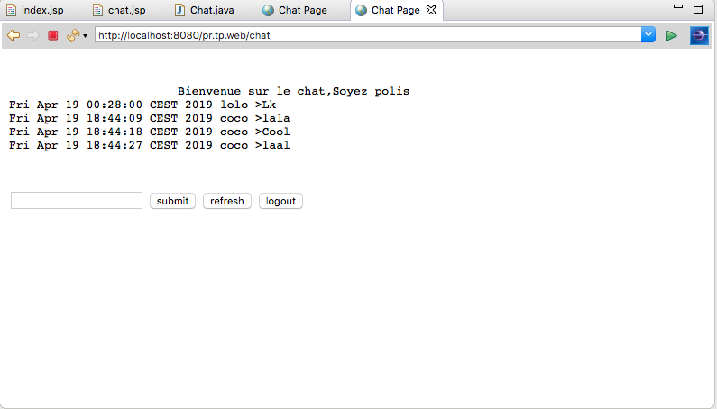
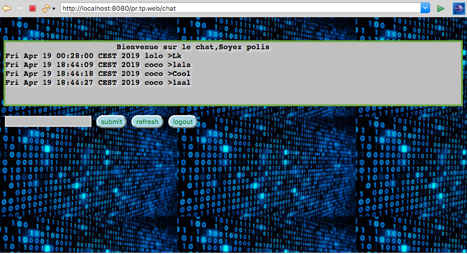

# Rapport TP IPR : TP : Les Servlets 

##  1-   Introduction 
Une servlet est un programme qui s’exécute côté serveur en tant qu’extension du serveur. Elle reçoit une requête du client, elle effectue des traitements et renvoie le résultat. La liaison entre la servlet et le client peut être directe ou passer par un intermédiaire comme par exemple un serveur http. Pour exécuter des applications web, il faut utiliser un conteneur web ou un serveur d’applications : il existe de nombreuses versions commerciales comme libres dans ce TP nous avons utilisé Tomcat v8.5. 
Ce serveur d’applications ou ce conteneur web doit utiliser ou inclure un serveur http dont le plus utilisé est Apache.Dans notre TP nous allons expérimenter différentes étapes d’exécution de servlets.

## 2-   Partie 1 : Chat anonyme  

Nous avons commencé par configurer Eclipse JavaEE afin d’ajouter une vue serveur pour Tomcat, car nous avons su son rôle pour la gestion de cycle
de vie du serveur.
    
     1 - En premier on suivie les étapes décritent sur le Readme fournit par l'encadrant.
     2 -Utilisation de l'annotation @WebServlet("/chat") indiquant que la servelet se trouvera à http://localhost:8080/pr.tp.web/chat. 

## 2.1-   Contenu 
Pour notre 'implémentatio,on s’est appuyé sur la javadoc de StringBuffer nous avons stocké le contenu
de notre servlet dans un stringbuffer qu’on a déclaré en attribut de classe et on a utilisé la fonction "append" pour ajouter un texte.
On a utilisé des concepts basiques de HTML car notre servlet devait contenir des élements d’une page HTML classique.

    package pr.tp.web.servlet;
    import java.io.IOException;
    import java.util.Date;
    import javax.servlet.RequestDispatcher;
    import javax.servlet.ServletConfig;
    import javax.servlet.ServletException;
    import javax.servlet.annotation.WebServlet;
    import javax.servlet.http.HttpServlet;
    import javax.servlet.http.HttpServletRequest;
    import javax.servlet.http.HttpServletResponse;
    import javax.servlet.http.HttpSession;

    @WebServlet("/chat")
    public class Chat extends HttpServlet {
     private static final long serialVersionUID = 197811968639586823L;
     private StringBuffer chatContent;
  
     public void init(ServletConfig config) throws ServletException 
  
     {     chatContent = new StringBuffer();

        chatContent.append("Bienvenue sur le chat").append(",");

      chatContent.append("Soyez polis").append("\n");
              
    }
    public StringBuffer getChatContent() {
    return chatContent;
    }

## 2.2-   Formulaire 
Dans cette section notre servlet devait avoir des champs pour saisir un message ainsi que des boutons d’action qui permettent de manipuler ces messages
soit : 

    - Envoyer la ligne écrite via le bouton submit.
    - Rafraîchir la page via le bouton refresh

En ce qui concerne le fonctionnement de notre servlet : 
à chaque fois elle vérifie le bouton ou l’action faite par l’utilisateur en utilisant getParameter("action"),et après éxecuter l’action tout ça est dans doGet(HttpServletRequest request,
HttpServletResponse response).  
  
## 3-  Partie 2 : Utilisation d'une JSP

La JSP est prise en compte dans notre chat afin de faciliter la manipulation
en séparant le HTML du traitement du contenu. Nos fichiers JSP sont acces-
sibles sur le serveur comme des .html classique via une URL. Pour l’inclure dans
la servlet nous avons utilisé :
   
  
       - Un RequestDispatcher qui transmet les requêtes et les réponses pour le serveur à la fin de la méthode doGet à travers le StringBuffer chatContent. 
       Nous récupérons dans la JSP par request.getAttribute("contenu").

## 4-   Partie 3 : Sessions

Dans cette partie nous avons introduit des demandes de noms des utilisa-
teurs pour assurer la connexion en utilisant les sessions. nous avons utilisé une autre JSP, qui contient un formulaire pour demander à l’utilisateur son nom.
La methode du formulaire est post, Donc dans notre servlet nous utilisons
doPost(HttpServletRequest request, HttpServletResponse response)
qui, à son tour, son unique rôle est d’appeller doGet(request, response)

## 5-  Partie 4  : Configuration du message de bienvenue 

Nous avons passé le message d’accueil directement via les paramètres de
l’application et plus précisemment dans le fichier .xml et on a modifié le code de la servlet pour pouvoir prendre en compte le paramètre dans la méthode
   
    public void init(ServletConfig config) throws ServletException 
	{     chatContent = new StringBuffer();
		  chatContent.append("Bienvenue sur le chat").append(",");
		  chatContent.append("Soyez polis").append("\n");        
	}

 Nous sommes allés un peu loin en ajoutant un bouton Logout pour se déconnecter, ainsi qu’en ajoutant du CSS et créant un war qui s’est  occupé de lancer Tomcat sans pour autant lancer Eclipse. 

## 6- Conclusion 

En conclusion, ce TP nous a, non seulement permis d’appliquer les connaissances que nous avons appris en cours sur les servlets, mais aussi de les approfondir notamment en ayant développé plusieurs savoir faire en JavaEE ainsi qu’approfondir les notions en J AVA et son utilité indéniable dans le web. 

